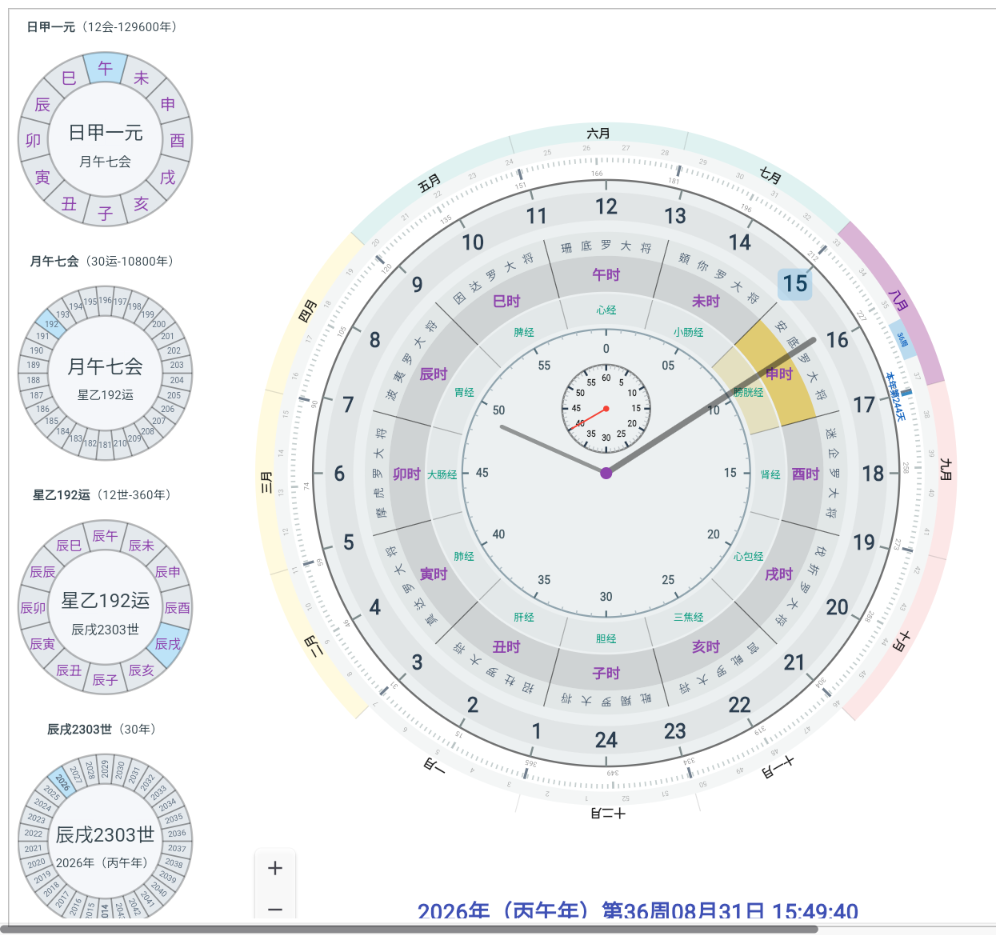

# flutter_application_1

Flutter 示例项目。

## 启动

### 1. 安装依赖

```bash
flutter pub get
```

### 2. 查看可用设备

```bash
flutter devices
```

当前环境里已确认可用的目标包括：

- Windows
- Chrome
- Edge

### 3. 启动项目

#### 推荐：本地 Web Server

这个方式在当前机器上已验证可启动。

```bash
flutter run -d web-server --web-hostname 127.0.0.1 --web-port 8080 --no-web-resources-cdn
```

启动后访问：`http://127.0.0.1:8080`

#### 直接跑浏览器

如果本机浏览器调试连接正常，可以使用：

```bash
flutter run -d chrome --no-web-resources-cdn
```

或：

```bash
flutter run -d edge --no-web-resources-cdn
```

### 4. 热重载常用命令

启动后在终端内可用：

- `r`：Hot reload
- `R`：Hot restart
- `q`：退出运行

## 代码结构

主要代码按职责分目录：

```text
lib/
	clock_page.dart          页面状态和主布局
	clock_painter.dart       大盘绘制主流程
	dial_painters.dart       四个小盘的 CustomPainter
	models/                  主题、圈层模型和时间计算
	widgets/                 工具栏、小盘组件和命中计算
	painter_parts/           大盘各圈层、刻度和动画绘制
```

### 调整圈层半径

圈层半径比例统一在以下文件中维护：

```text
lib/models/clock_models.dart
```

主要配置类：

```dart
ClockRadiusFactors
```

调整 24 小时圈时，应同时确认数字、刻度和外侧细线的半径保持一致。

### 运行检查

提交代码前建议执行：

```bash
dart format lib test
flutter analyze lib test
flutter test
```

## 已知限制

### Windows 桌面端

当前机器直接运行：

```bash
flutter run -d windows
```

会因为缺少 Visual Studio C++ toolchain 失败。需要先安装带有 Desktop development with C++ 工作负载的 Visual Studio，再执行：

```bash
flutter doctor
```

确认环境通过后再启动 Windows 桌面端。

## 发布与部署

### 1. 更新版本号

修改项目根目录下的 `pubspec.yaml` 中的版本号，例如：

```yaml
version: 1.0.0+1
```

升级为：

```yaml
version: 1.0.1+2
```

其中：

- `1.0.1`：对外显示版本号
- `2`：构建编号，每次发版递增

### 2. 构建 Web 发布包

在项目根目录执行：

```bash
flutter clean
flutter pub get
flutter build web --release --base-href /time/
```

如果要部署到网站根目录，则使用：

```bash
flutter build web --release --base-href /
```

### 3. 部署到 Nginx

将构建产物复制到站点目录：

```bash
sudo rm -rf /var/www/time/*
sudo cp -r build/web/* /var/www/time/
```

检查配置并重载：

```bash
sudo nginx -t
sudo systemctl reload nginx
```

访问方式：

```text
http://你的域名/time/
```

或：

```text
http://服务器IP/time/
```

### 4. 直接本机预览构建结果

如果想在本机查看打包后的页面，不依赖正式 Nginx，可在项目根目录执行：

```bash
python -m http.server 8080 --directory build/web
```

然后访问：

```text
http://127.0.0.1:8080/
```

如果你使用了 `/time/` 的 context path，访问时需要使用：

```text
http://127.0.0.1:8080/time/
```

### 5. 常见注意事项

- `base-href` 和 Nginx 的访问路径必须一致
- 访问 `/time/` 时，必须保证 `build/web` 中的资源被正确放到 `/var/www/time/`
- 每次更新代码后，需要重新执行 `flutter build web --release`
- 如果页面仍然显示旧内容，请先清理旧文件再复制新文件

## 参考

- [Flutter 文档](https://docs.flutter.dev/)

## 页面截图


